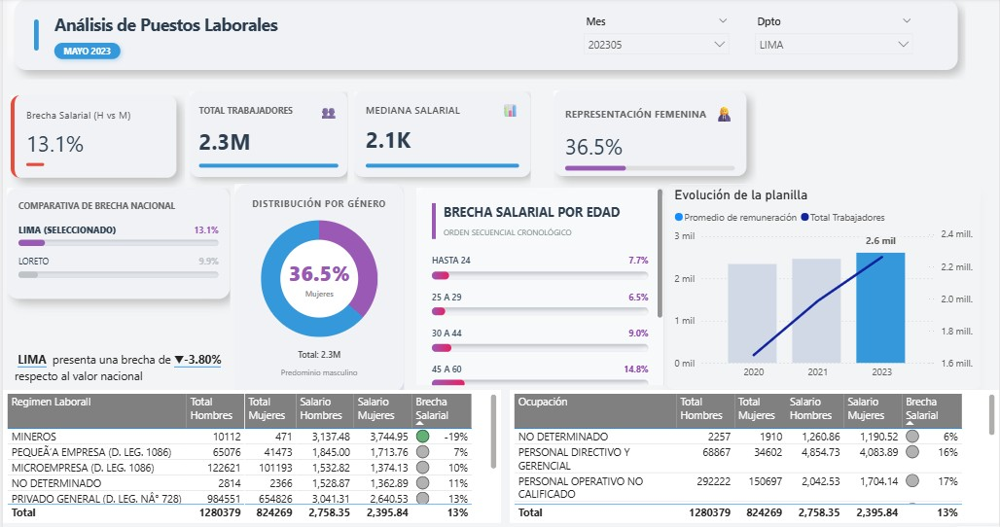

# 📊 Análisis del Mercado Laboral Formal en Lima (MTPE - Datos Abiertos)
**Período:** Febrero 2026

## 🎯 Descripción del Proyecto
En este proyecto analicé la situación de los puestos de trabajo en el sector 
formal privado de Lima, utilizando los datasets oficiales del Ministerio de 
Trabajo y Promoción del Empleo (MTPE). El objetivo fue transformar datos públicos 
en un tablero de control (dashboard) que permita identificar tendencias salariales 
y brechas de género de manera rápida.

## 📸 Dashboard

## 🔍 Hallazgos Clave (Mayo 2023)

### 💰 Brecha Salarial
- Brecha general del **13.1% a favor de los hombres**
- Las mujeres ganan en promedio 13.1% menos que sus pares masculinos en Lima
- Segmentando por edad: **7.7% en jóvenes** vs **14.8% en el grupo de 45-60 años**
- Esto sugiere que a mayor antigüedad o nivel jerárquico, la disparidad salarial tiende a profundizarse

### 👥 Participación por Género
- La fuerza laboral formal en Lima está compuesta en un **36.5% por mujeres**
- Esto representa una oportunidad de mejora en representatividad dentro del sector privado

### 🏭 Sectores Específicos
- **Minería:** caso atípico con brecha inversa **(-19%)**, aunque con participación femenina muy reducida (~4%)
- Solo 471 mujeres vs 10,112 hombres en ese sector
- Las mujeres en minería ganan más, pero su presencia es mínima

### 📈 Evolución Salarial
- Recuperación sostenida desde 2020
- Sueldo promedio alcanzó **S/ 2,600** en Lima al cierre del período analizado

## 💡 Conclusión
Este tablero facilita la lectura de indicadores complejos para la toma de 
decisiones informadas sobre políticas de equidad y mercado laboral.

## 🛠️ Herramientas
| Herramienta | Uso |
|-------------|-----|
| Power BI | Modelado de datos, DAX y visualización |

## 🏅 Aptitudes Desarrolladas
`Análisis de datos` `Visualización de datos` `Business Intelligence`

## 📂 Fuente de Datos
Plataforma Nacional de Datos Abiertos - MTPE  
[🔗 Dataset oficial](https://www.datosabiertos.gob.pe/dataset/puestos-de-trabajo-registrados-en-el-sector-formal-asalariado-privado-periodo-primer)

## 👤 Autor
**Manuel Sanchez Cárdenas**  
Analista de Inteligencia Comercial | Power BI · SQL · Python  
[LinkedIn](https://www.linkedin.com/in/msanchezc96/)
